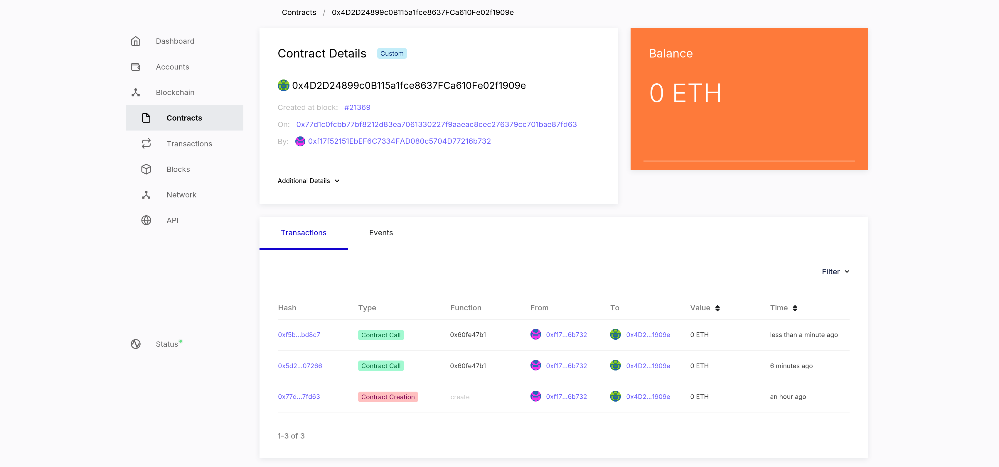

# Private Ethereum Network with Besu (on Guix)

Instructions on how-to setup (and interact with) a private Ethereum network with proof of authority (QBFT) consensus algorithm using Besu.

### Setup Besu

```bash
wget https://github.com/hyperledger/besu/releases/download/25.2.2/besu-25.2.2.zip
unzip besu-25.2.2.zip && mv besu-25.2.2 besu
```

Setup a guix environment, and check if besu is working:

```bash
guix shell openjdk jq
./besu/bin/besu --version
```

### Configure the network

Create a genesis config `qbftConfigFile.json`. This file is already provided in the repository; Adjust it to your liking:

```json
{
  "genesis": {
    "config": {
      "chainId": 1337,
      "londonBlock": 0,
      "qbft": {
        "blockperiodseconds": 2,
        "epochlength": 30000,
        "requesttimeoutseconds": 4
      }
    },
    "nonce": "0x0",
    "timestamp": "0x58ee40ba",
    "gasLimit": "0x1C9C380",
    "difficulty": "0x1",
    "mixHash": "0x63746963616c2062797a616e74696e65206661756c7420746f6c6572616e6365",
    "coinbase": "0x0000000000000000000000000000000000000000",
    "alloc": {
      "fe3b557e8fb62b89f4916b721be55ceb828dbd73": {
        "privateKey": "8f2a55949038a9610f50fb23b5883af3b4ecb3c3bb792cbcefbd1542c692be63",
        "comment": "private key and this comment are ignored.  In a real chain, the private key should NOT be stored",
        "balance": "0xad78ebc5ac6200000"
      },
      "627306090abaB3A6e1400e9345bC60c78a8BEf57": {
        "privateKey": "c87509a1c067bbde78beb793e6fa76530b6382a4c0241e5e4a9ec0a0f44dc0d3",
        "comment": "private key and this comment are ignored.  In a real chain, the private key should NOT be stored",
        "balance": "90000000000000000000000"
      },
      "f17f52151EbEF6C7334FAD080c5704D77216b732": {
        "privateKey": "ae6ae8e5ccbfb04590405997ee2d52d2b330726137b875053c36d94e974d162f",
        "comment": "private key and this comment are ignored.  In a real chain, the private key should NOT be stored",
        "balance": "90000000000000000000000"
      }
    }
  },
  "number": "0x0",
  "gasUsed": "0x0",
  "parentHash": "0x0000000000000000000000000000000000000000000000000000000000000000",
  "blockchain": {
    "nodes": {
      "generate": true,
      "count": 6
    }
  }
}
```

There's a couple of things to be aware:

- The `cancunBlock` is the latest Ethereum milestone block, but I've had trouble with it (RPC errors like `ChainId not supported`), and reverted to `londonBlock`. Replace it with whatever milestone to start with; Usually it's best to stick to the latest from [here](https://besu.hyperledger.org/23.7.2/public-networks/reference/genesis-items#milestone-blocks) or [here](https://github.com/ethereum/execution-specs#ethereum-protocol-releases).
- Blockhain nodes count: 7 (2x redundancy)

Create the file structure for nodes:

```bash
mkdir -p network/node-1/data network/node-2/data network/node-3/data network/node-4/data network/node-5/data network/node-6/data network/node-7/data
```

(Optional) Generate accounts:

_This will replace the existing accounts in the `qbftConfigFile` genesis file._

```bash
# Read the instructions at accounts/README.md, or you'll get the default.
cd accounts && pnpm install && pnpm run generate
```

Generate the keys for the nodes:

```bash
$ ./besu/bin/besu operator generate-blockchain-config --config-file=qbftConfigFile.json --to=networkFiles --private-key-file-name=key

# Result
$ tree networkFiles/
networkFiles/
├── genesis.json
└── keys
    ├── 0x3630f48b632d998fa54fd2e08a77a627aabdbd77
    │   ├── key
    │   └── key.pub
    ├── 0x422ef4e30554229ee8bd7bd576bc28b95ba9a733
    │   ├── key
    │   └── key.pub
    ├── 0x628da40ed943b3f57813058808d35f08b9125402
    │   ├── key
    │   └── key.pub
    ├── 0x992fd1dad418738a6a4a83cc80b3cacc85963822
    │   ├── key
    │   └── key.pub
    ├── 0xa8f66aa0e453ba1ecd9a722a7cb69c2369305517
    │   ├── key
    │   └── key.pub
    └── 0xf7b6f5857b179f705277bb489164d0921b94eb7e
        ├── key
        └── key.pub
```


Move the keys and genesis.json to the respective node directories:

```bash
$ bash move-generated-files.sh

# Result
$ tree network/
network/
├── node-1
│   ├── data
│   │   ├── key
│   │   └── key.pub
│   ├── genesis.json
│   ├── http-port
│   └── p2p-port
├── node-2
│   ├── data
│   │   ├── key
│   │   └── key.pub
│   ├── genesis.json
│   ├── http-port
│   └── p2p-port
├── node-3
│   ├── data
│   │   ├── key
│   │   └── key.pub
│   ├── genesis.json
│   ├── http-port
│   └── p2p-port
├── node-4
│   ├── data
│   │   ├── key
│   │   └── key.pub
│   ├── genesis.json
│   ├── http-port
│   └── p2p-port
├── node-5
│   ├── data
│   │   ├── key
│   │   └── key.pub
│   ├── genesis.json
│   ├── http-port
│   └── p2p-port
└── node-6
    ├── data
    │   ├── key
    │   └── key.pub
    ├── genesis.json
    ├── http-port
    └── p2p-port

13 directories, 30 files
```

### Start the network

#### Bootnode

Now you can start the first node, in a new terminal:

```bash
cd network/node-1
guix shell openjdk -- ../../besu/bin/besu --data-path=data --genesis-file=genesis.json --rpc-http-enabled --rpc-http-api=ETH,NET,QBFT --host-allowlist="*" --rpc-http-cors-origins="all" --p2p-port=30303
```

Optionally, from the output, record the encode URL; For ex.:

```bash
2025-03-09 09:52:05.176+00:00 | main | INFO  | DefaultP2PNetwork | Enode URL enode://3b88135adbbeb081ec04c1ba403d6675af6200f031dfbc72c725adb0c3f5021cfbaca654798da6e59b0cfdb8c94b55b0fd83d0c895616dbb3de23d89f4597c5a@127.0.0.1:30303
```

#### Nodes

Now to start the second node, in a new terminal:

```bash
cd network/node-2
guix shell openjdk -- ../../besu/bin/besu --data-path=data --genesis-file=genesis.json --rpc-http-enabled --rpc-http-api=ETH,NET,QBFT --host-allowlist="*" --rpc-http-cors-origins="all" --bootnodes=enode://5b5a2ac557e8cb769afa6ca4bb33ba5218fe41c57ec1163db8efe757e74ccd37cdc02563b8073086a38dd31689b8a8c57f44dd252c69a044005af5ade7b389aa@127.0.0.1:30303 --p2p-port=30304 --rpc-http-port=8546
```

or use the provided script, each line in a new terminal:

```bash
bash launch-node.sh node-2 127.0.0.1 ETH,NET,QBFT,WEB3,TRACE,DEBUG,ADMIN
bash launch-node.sh node-3
bash launch-node.sh node-4
bash launch-node.sh node-5
bash launch-node.sh node-6
bash launch-node.sh node-7
```

You can verify all peers are online:

```bash
curl -X POST --data '{"jsonrpc":"2.0","method":"qbft_getValidatorsByBlockNumber","params":["latest"], "id":1}' localhost:8545
```

Result

```json
{
    "jsonrpc":"2.0",
    "id":1,
    "result": [
        "0x3630f48b632d998fa54fd2e08a77a627aabdbd77",
        "0x422ef4e30554229ee8bd7bd576bc28b95ba9a733",
        "0x628da40ed943b3f57813058808d35f08b9125402",
        "0x992fd1dad418738a6a4a83cc80b3cacc85963822",
        "0xa8f66aa0e453ba1ecd9a722a7cb69c2369305517",
        "0xf7b6f5857b179f705277bb489164d0921b94eb7e"
    ]
}
```

Within a couple of minutes, you should see the block number increasing:

```bash
2025-03-09 10:15:20.859+00:00 | EthScheduler-Timer-0 | INFO  | FullSyncTargetManager | Unable to find sync target. Waiting for 5 peers minimum. Currently checking 5 peers for usefulness
2025-03-09 10:15:21.664+00:00 | BftProcessorExecutor-QBFT-0 | INFO  | RoundChangeManager | BFT round summary (quorum = 4)
2025-03-09 10:15:21.664+00:00 | BftProcessorExecutor-QBFT-0 | INFO  | RoundChangeManager | Address: 0x992fd1dad418738a6a4a83cc80b3cacc85963822  Round: 5 (Local node)
2025-03-09 10:15:21.665+00:00 | BftProcessorExecutor-QBFT-0 | INFO  | RoundChangeManager | Address: 0xf7b6f5857b179f705277bb489164d0921b94eb7e  Round: 5
2025-03-09 10:15:21.665+00:00 | BftProcessorExecutor-QBFT-0 | INFO  | RoundChangeManager | Address: 0xa8f66aa0e453ba1ecd9a722a7cb69c2369305517  Round: 5
2025-03-09 10:15:21.665+00:00 | BftProcessorExecutor-QBFT-0 | INFO  | RoundChangeManager | Address: 0x3630f48b632d998fa54fd2e08a77a627aabdbd77  Round: 6
2025-03-09 10:15:21.665+00:00 | BftProcessorExecutor-QBFT-0 | INFO  | RoundChangeManager | Address: 0x422ef4e30554229ee8bd7bd576bc28b95ba9a733  Round: 6
2025-03-09 10:15:21.665+00:00 | BftProcessorExecutor-QBFT-0 | INFO  | RoundChangeManager | Address: 0x628da40ed943b3f57813058808d35f08b9125402  Round: 5
2025-03-09 10:15:21.729+00:00 | BftProcessorExecutor-QBFT-0 | INFO  | QbftRound | Importing proposed block to chain. round=ConsensusRoundIdentifier{Sequence=1, Round=5}, hash=0xc0871cb0bd986548a35f12aadb0174522e17c6d3ee28245ee13ac1b070bddc51
2025-03-09 10:15:21.789+00:00 | BftProcessorExecutor-QBFT-0 | INFO  | QbftBesuControllerBuilder | Imported empty block #1 / 0 tx / 0 pending / 0 (0.0%) gas / (0xc0871cb0bd986548a35f12aadb0174522e17c6d3ee28245ee13ac1b070bddc51)
2025-03-09 10:15:23.068+00:00 | BftProcessorExecutor-QBFT-0 | INFO  | QbftBesuControllerBuilder | Imported empty block #2 / 0 tx / 0 pending / 0 (0.0%) gas / (0x834df30d707f27f287f3c5f181546448da901bc2e384d3071c0cc482a16358c7)
2025-03-09 10:15:23.078+00:00 | EthScheduler-Workers-0 | INFO  | PersistBlockTask | Block 2 (0x834df30d707f27f287f3c5f181546448da901bc2e384d3071c0cc482a16358c7) is already imported
2025-03-09 10:15:25.074+00:00 | BftProcessorExecutor-QBFT-0 | INFO  | QbftBesuControllerBuilder | Imported empty block #3 / 0 tx / 0 pending / 0 (0.0%) gas / (0xfb409380276bcfff61d3513ca41e76fc231586b3575276ac8333fda47979121c)
```

You can also check the block number:

```bash
curl -X POST --data '{"jsonrpc":"2.0","method":"eth_blockNumber","params":[], "id":1}' localhost:8545
```

Result

```json
{"jsonrpc":"2.0","id":1,"result":"0x57"}
```

### Wallet

To play with the network on Metamask, add it as "Custom Network" with the following details:

- Name: Besu DEV
- New RPC URL: http://localhost:8545
- Chain ID: 1337
- Currency Symbol: BESU

Once you added the network, you can import the accounts using the private keys from the `genesis.json` file.

1. Add a new account
2. Import, and paste the private key from the `genesis.json` file
3. You should see the balance of the account (200 BESU)

Repeat this for the second account, and make a transfer between them; It should show-up in the logs:

```bash
2025-03-09 10:34:21.019+00:00 | BftProcessorExecutor-QBFT-0 | INFO  | QbftBesuControllerBuilder | Imported empty block #571 / 0 tx / 1 pending / 0 (0.0%) gas / (0xcde78d11808b554e55d83f843f3a160b0f413f2ad382ee6a5c9730956bacde88)
```

### Indexing with TrueBlocks

Do this in a seperate directory [ref](https://trueblocks.io/docs/install/install-core/):

```bash
guix shell git cmake make gcc-toolchain ninja curl python jq go
git clone --depth 1 --no-single-branch --recurse-submodules --branch v4.2.0 https://github.com/TrueBlocks/trueblocks-core
cd trueblocks-core
mkdir build && cd build
../scripts/go-work-sync.sh
cmake ../src
make
```

I don't like to pollute my paths, so I just set it for the current shell:

```bash
export PATH="/home/franz/git/trueblocks-core/bin:$PATH"
```

Run the application once, to generate the config:

```bash
chifra config --paths
```

Next, edit the config

```bash
$ nvim ~/.config/trueBlocks.toml
```

1. Look for section `[chains.mainnet]`
2. Set `chainId = "1337"`
2. Set `rpcProvider = "http://localhost:8546"`

#### Usage

Note: The `TB_NO_PROVIDER_CHECK=true` is necessary, because of a failing check. I discuss this in the issue [here](https://github.com/TrueBlocks/trueblocks-core/issues/3973).

Query a block:

```bash
$ TB_NO_PROVIDER_CHECK=true chifra blocks 23021
INFO[10-03|15:00:33.965] Skipping rpcProvider check
WARN[10-03|15:00:33.973] the --calldata value provided (manifestHashMap(0x0, "mainnet-ts")) was not found: abi not found for manifestHashMap(0x0, "mainnet-ts"): abi not found
{
  "data": [
    {
      "baseFeePerGas": 0,
      "blockNumber": 23021,
      "date": "2025-03-10 11:47:03 UTC",
      "difficulty": 1,
      "gasLimit": 4700000,
      "gasUsed": 25009,
      "hash": "0x8daeb989f85f23faf4dd605cfb50fcb1adb7e569074713f0b3c2a3e6945796fb",
      "miner": "0xf7b6f5857b179f705277bb489164d0921b94eb7e",
      "parentHash": "0x7a79fda98accab9876ebfd424b5603f6933b57944a9a32bc086e3605c50a6899",
      "timestamp": 1741607223,
      "transactions": [
        {
          "blockHash": "0x8daeb989f85f23faf4dd605cfb50fcb1adb7e569074713f0b3c2a3e6945796fb",
          "blockNumber": 23021,
          "date": "2025-03-10 11:47:03 UTC",
          "ether": "0",
          "from": "0xf17f52151ebef6c7334fad080c5704d77216b732",
          "gas": 25096,
          "gasCost": 30010800,
          "gasPrice": 1200,
          "gasUsed": 25009,
          "hash": "0xf5bb5c29a62e39f09911f81eb7e93097f5ac8d304c995908736e4b17777bd8c7",
          "input": "0x60fe47b10000000000000000000000000000000000000000000000000000000000000064",
          "nonce": 3,
          "receipt": {
            "contractAddress": "0x0",
            "effectiveGasPrice": 1200,
            "gasUsed": 25009,
            "logs": [
              {
                "address": "0x4d2d24899c0b115a1fce8637fca610fe02f1909e",
                "data": "0x000000000000000000000000f17f52151ebef6c7334fad080c5704d77216b7320000000000000000000000000000000000000000000000000000000000000064",
                "date": "2025-03-10 11:47:03 UTC",
                "logIndex": 0,
                "timestamp": 1741607223,
                "topics": [
                  "0xc9db20adedc6cf2b5d25252b101ab03e124902a73fcb12b753f3d1aaa2d8f9f5"
                ]
              }
            ],
            "status": null
          },
          "timestamp": 1741607223,
          "to": "0x4d2d24899c0b115a1fce8637fca610fe02f1909e",
          "traces": [],
          "transactionIndex": 0,
          "value": "0"
        }
      ],
      "uncles": [],
      "withdrawals": []
    }
  ]
}
```

### Indexing with Chainlens

```bash
git clone https://github.com/web3labs/chainlens-free
cd chainlens-free/docker-compose
```

Because of how I have this setup, I made some changes to the `docker-compose.yml`, to run with host networking:

```yml
version: "3.6"
services:
  api:
    image: web3labs/epirus-free-api:latest
    environment:
      - NODE_ENDPOINT=${NODE_ENDPOINT}
      - MONGO_CLIENT_URI=mongodb://127.0.0.1:27017
      - REINDEX_ENDPOINT=http://ingestion/reindex/
      - MONGO_DB_NAME=epirus
      - MONGO_CREATE_INDICES=true
      - REDIS_HOST=127.0.0.1
      - REDIS_PORT=6379
    depends_on:
      - redis 
      - mongodb
    network_mode: "host"
  
  mongodb:
    image: mongo:5.0.8
    environment:
      - COMPOSE_HTTP_TIMEOUT=900
      - DOCKER_CLIENT_TIMEOUT=900
    entrypoint: mongod --bind_ip "127.0.0.1"
    network_mode: "host"

  redis:
    image: redis
    restart: unless-stopped
    container_name: redis
    network_mode: "host"

  web:
    image: web3labs/epirus-free-web:latest
    environment:
      - API_URL=/api
      - WS_API_URL=ws://localhost:8090
      - DISPLAY_NETWORK_TAB=disabled
    depends_on:
      - api
    network_mode: "host"
  
  ingestion:
    image: web3labs/epirus-free-ingestion:latest
    environment:
      - NODE_ENDPOINT=${NODE_ENDPOINT}
      - MONGO_CLIENT_URI=mongodb://127.0.0.1:27017
      - MONGO_DB_NAME=epirus
      - LIST_OF_METRICS_TO_CALCULATE_PER_MINUTE=hourly,daily,monthly,yearly
    depends_on:
      - mongodb
      - redis
    network_mode: "host"
      
  nginx:
    image: nginx:latest
    volumes:
      - ./nginx.conf:/etc/nginx/nginx.conf
      - ./5xx.html:/www/error_pages/5xx.html
    depends_on:
      - api
      - web
    network_mode: "host"
```

as well as the `nginx.conf` config:

```nginx
events { }

http {
  server {
    listen 80;
    charset utf-8;

    location /api/ {
        proxy_pass http://127.0.0.1:8090/;
    }

    location / {
      proxy_pass http://127.0.0.1:3000/;
    }

    error_page 500 502 503 504 /5xx.html;
    location /5xx.html {
      root /www/error_pages/;
    } 
  }
}
```

Start Docker:

```bash
NODE_ENDPOINT=http://127.0.0.1:8546 docker-compose -f docker-compose.yml -f chainlens-extensions/docker-compose-quorum-dev-quickstart.yml up
```

You can access the Chainlens UI at [http://localhost:80](http://localhost:80).

### Smart Contract

Next, let's deploy a smart contract; We're following an example from the besu documentation, with minor changes.

#### Deploy

Start a new environment:

```bash
# You may use npm instead of pnpm
guix node pnpm
cd smart-contract
pnpm install
```

Compile the contract:

```bash
node compile.js
```

Submit the contract:

```bash
$ node deploy.js
Creating transaction...
Signing transaction...
Sending transaction...
tx transactionHash: 0x77d1c0fcbb77bf8212d83ea7061330227f9aaeac8cec276379cc701bae87fd63
tx contractAddress: 0x4d2d24899c0b115a1fce8637fca610fe02f1909e
```

If you setup Chainlens previously, you should be able to see the contract now.

#### Interact

Now, let's interact with the contract:

```bash
node query_contract.js
```

This will:

1. Read the current value
2. Fetch all past events
3. Set a new value
4. Read the new value



This repository contains examples for a ERC20 and ERC721 and custom contract

### Credits

This guide is based on [Create a private network using QBFT](https://besu.hyperledger.org/private-networks/tutorials/qbft)
